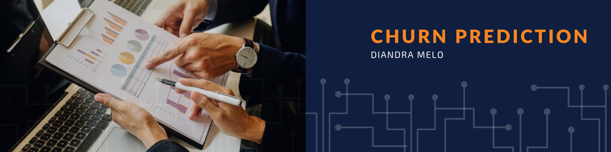

# Churn_Prediction

Binary classification forecast with Machine Learning.

This Data Science project presents a classification problem of predicting the probability of the clients with a bank account to churn, based on a set of databased features. For that, 10,000 transaction records are going to be considered as part of a fictional bank company called EuroBank. The project was inspired in a database available from a [Kaggle competition](https://www.kaggle.com/mervetorkan/churndataset).

If you wish to check the coding for this project, access the Jupyter Notebook [here](https://github.com/diandramelo/Churn_Prediction/blob/main/v01-churn_prediction.ipynb); there is also a Storytelling slide presentation available [here](https://github.com/diandramelo/Churn_Prediction/blob/main/P04-Storytelling.pdf).
